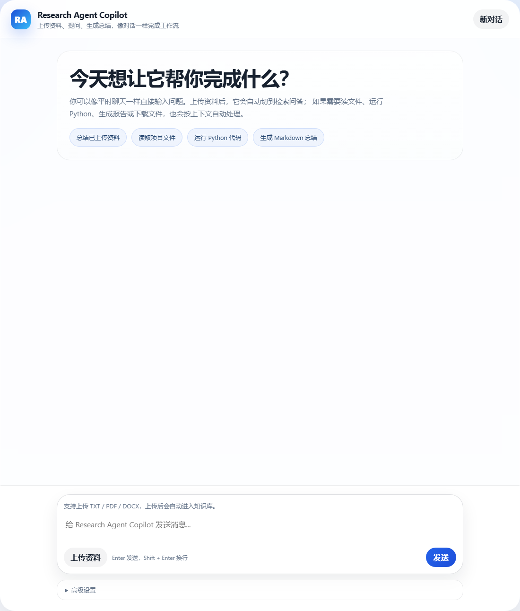
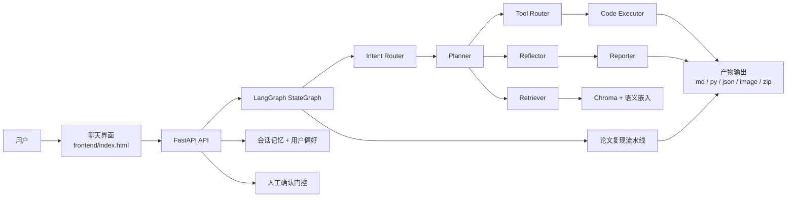

# Research Agent Copilot



[](https://fastapi.tiangolo.com/)
[](https://www.langchain.com/)
[](https://www.deepseek.com/)
[](LICENSE)

一个面向论文阅读、技术文档处理与实验复现的全栈科研 Agent，支持基于本地资料的问答、工具调用、受控代码执行，以及可下载的结构化输出产物。

## 项目简介

Research Agent Copilot 的核心目标很直接：让科研工作流像聊天一样易用，同时保留检索、工具执行与结果生成的结构化、可追踪与安全性。

当前版本主要提供以下能力：

- 基于 DeepSeek 与 LangChain 的对话式交互
- 面向 TXT、PDF、DOCX 的文档解析与 RAG 检索问答
- 带安全边界的文件读取与受限 Python 执行
- 对敏感操作提供人工确认机制
- 支持 Markdown、Python、JSON、图片、ZIP 等可下载结果产物

## 核心亮点

- 采用简洁的单页聊天界面，降低上手成本
- 基于 LangGraph StateGraph 搭建工作流，覆盖意图识别、任务规划、检索、工具路由、代码执行、反思与报告生成
- 使用多语言 sentence-transformer 嵌入模型与 Chroma 实现语义检索
- 通过 AST 约束实现可审查、可控制的 Python 执行能力
- 输出不仅限于聊天文本，还能直接生成可下载的技术文档与代码产物
- 包含日志、重试、评测数据与自动化测试能力
- 支持论文复现流程，可输出复现实验脚本、图表、指标 JSON、Markdown 报告与 ZIP 打包文件

## 系统架构

```text
前端（聊天界面）
    |
    v
FastAPI 后端
    |
    +-- LangGraph 工作流编排
    +-- RAG 链路（提取 -> 切分 -> 嵌入 -> 检索）
    +-- 会话记忆与用户偏好
    +-- 带确认门控的工具执行
    +-- 结果产物生成（md / py / zip）
    +-- 论文复现流水线（论文 -> 代码 -> 图表 -> 报告）
    +-- 评测与日志工具
```

### 架构图



## 技术栈

- 后端：FastAPI
- Agent 编排：LangChain、langchain-deepseek、LangGraph
- 向量数据库：Chroma
- 嵌入模型：sentence-transformers、langchain-huggingface
- 前端：HTML、CSS、JavaScript
- 测试：pytest

## 仓库结构

```text
research-agent/
|-- backend/
|   |-- app/
|   |   |-- agent.py
|   |   |-- artifacts.py
|   |   |-- confirmations.py
|   |   |-- config.py
|   |   |-- evaluation.py
|   |   |-- llm.py
|   |   |-- logging_utils.py
|   |   |-- main.py
|   |   |-- memory.py
|   |   |-- prompts.py
|   |   |-- rag.py
|   |   |-- reproduction.py
|   |   |-- schemas.py
|   |   `-- tools.py
|   `-- requirements.txt
|-- data/
|   |-- evals/
|   |   `-- day5_eval_dataset.jsonl
|   |-- processed/
|   |   `-- .gitkeep
|   `-- raw/
|       |-- .gitkeep
|       `-- sample_research_note.txt
|-- frontend/
|   `-- index.html
|-- tests/
|   `-- test_api.py
|-- assets/
|   `-- ui-screenshot.png
|-- CONTRIBUTING.md
|-- LICENSE
`-- README.md
```

## 快速开始

### 1. 创建虚拟环境

```powershell
python -m venv .venv
.\.venv\Scripts\Activate.ps1
```

### 2. 安装依赖

```powershell
pip install -r backend\requirements.txt
```

### 3. 配置环境变量

复制 `.env.example` 为 `.env`，并填入你自己的 DeepSeek API Key。

```env
DEEPSEEK_API_KEY=your_api_key_here
DEEPSEEK_BASE_URL=https://api.deepseek.com
MODEL_NAME=deepseek-v4-pro
SYSTEM_PROMPT=You are Research Agent Copilot, a helpful assistant for research and technical documents.
CHROMA_COLLECTION_NAME=research_docs_semantic_v1
CHUNK_SIZE=500
CHUNK_OVERLAP=100
RETRIEVAL_TOP_K=4
EMBEDDING_MODEL_NAME=sentence-transformers/paraphrase-multilingual-MiniLM-L12-v2
EMBEDDING_DEVICE=cpu
EMBEDDING_NORMALIZE=true
```

### 4. 启动服务

```powershell
uvicorn app.main:app --app-dir backend --reload
```

打开以下地址：

- `http://127.0.0.1:8000/`
- `http://127.0.0.1:8000/docs`

## 核心 API

| 接口 | 说明 |
| --- | --- |
| `POST /chat` | 标准聊天补全接口 |
| `POST /documents/upload` | 上传 TXT、PDF、DOCX 文档到 RAG 知识库 |
| `POST /documents/ingest-path` | 通过本地路径导入 TXT、PDF、DOCX 文档 |
| `POST /chat/rag` | 基于已导入资料进行检索增强问答 |
| `POST /agent/chat` | 统一 Agent 入口，支持聊天、检索、报告、工具与研究流程 |
| `POST /agent/confirm/{token}` | 批准或取消待确认的工具操作 |
| `POST /tools/read-file` | 读取工作区文件 |
| `POST /tools/python` | 运行受限 Python 代码 |
| `GET /artifacts/{artifact_id}/download` | 下载生成结果 |
| `GET /evaluation/dataset` | 查看内置评测数据集 |

## 示例工作流

### 1. 基于资料的摘要问答

1. 上传 `data/raw/sample_research_note.txt`
2. 提问：`Please summarize the core idea of RAG and include citations.`
3. 获得带引用的回答、检索到的来源片段，以及可下载的 Markdown 产物

### 2. 带人工确认的 Python 执行

发送请求：

```json
{
  "message": "Please run this Python code ```python\nprint(sum([10, 20, 30]))\n```",
  "session_id": "session-demo",
  "user_id": "user-demo",
  "mode": "tool",
  "require_confirmation": true
}
```

系统会暂停执行并返回确认 token。你可以通过以下接口批准或取消：

```json
POST /agent/confirm/{token}
{
  "action": "approve"
}
```

### 3. 论文复现流程

发送一个 `research` 模式请求，并传入本地论文路径：

```json
{
  "message": "Please reproduce this paper with runnable Python code and generate a technical report.",
  "session_id": "paper-repro-demo",
  "user_id": "research-user",
  "mode": "research",
  "document_paths": [
    "D:/papers/alpha-stable-vlf-paper.pdf"
  ]
}
```

系统会自动完成以下步骤：

- 将论文导入向量知识库
- 通过 LangGraph 节点规划任务
- 检索关键公式与实验参数
- 生成并执行独立的 Python 复现脚本
- 返回可下载的图表、指标 JSON、Markdown 报告与 ZIP 打包文件

## 开发说明

运行测试：

```powershell
pytest -q
```

贡献说明见 [CONTRIBUTING.md](CONTRIBUTING.md)。如果是较大的改动，建议先提交 Issue 再开始实现。

## 仓库规范

本仓库刻意保持轻量，只保留项目本体相关内容，不提交以下内容：

- 本地虚拟环境或依赖缓存
- 私有 `.env` 配置
- 运行日志
- 个人学习记录或无关说明文档
- 本地生成的向量库、记忆缓存与实验残留文件

## 后续规划

- 聊天界面的流式输出
- 更完整的会话历史与 Session 管理
- 更丰富的产物预览能力
- 更全面的自动化评测
- 更多适用于科研场景的安全工具

## 许可证

本项目基于 [MIT License](LICENSE) 开源发布。
