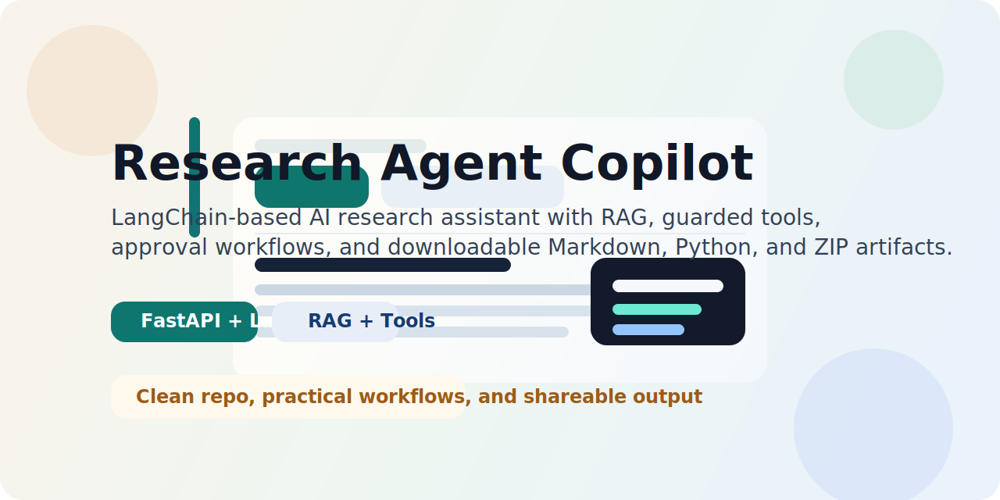

# Research Agent Copilot



[](https://fastapi.tiangolo.com/)
[](https://www.langchain.com/)
[](https://www.deepseek.com/)
[](LICENSE)

A full-stack AI research assistant for document-grounded Q&A, report generation, safe tool execution, and downloadable output artifacts.

## Why This Project

Research Agent Copilot is a practical agent app built around a simple idea: make research workflows feel as easy as chatting, while still keeping retrieval, tool usage, and output generation structured and safe.

It combines:

- Chat-style interaction powered by DeepSeek through LangChain
- Retrieval-augmented generation over uploaded TXT, PDF, and DOCX documents
- Guarded tools for file reading and restricted Python execution
- Human-in-the-loop confirmation before sensitive actions
- Downloadable outputs such as Markdown reports, Python files, and ZIP bundles

## Highlights

- Single-page frontend designed around a clean chat experience
- LangChain-centered workflow for chat, RAG, tool routing, and report generation
- Semantic retrieval with multilingual sentence-transformer embeddings and Chroma
- AST-restricted Python execution for simple, inspectable code tasks
- Downloadable artifacts that make generated output easy to save and share
- Structured retries, logging, evaluation utilities, and automated tests

## Architecture

```text
Frontend (chat UI)
    |
    v
FastAPI backend
    |
    +-- LangChain workflow orchestration
    +-- RAG pipeline (extract -> chunk -> embed -> retrieve)
    +-- Session memory and user preferences
    +-- Tool execution with confirmation gates
    +-- Artifact generation (md / py / zip)
    +-- Evaluation and logging utilities
```

## Tech Stack

- Backend: FastAPI
- Agent framework: LangChain, langchain-deepseek
- Vector database: Chroma
- Embeddings: sentence-transformers, langchain-huggingface
- Frontend: HTML, CSS, JavaScript
- Testing: pytest

## Repository Layout

```text
research-agent/
|-- backend/
|   |-- app/
|   |   |-- agent.py
|   |   |-- artifacts.py
|   |   |-- confirmations.py
|   |   |-- config.py
|   |   |-- evaluation.py
|   |   |-- llm.py
|   |   |-- logging_utils.py
|   |   |-- main.py
|   |   |-- memory.py
|   |   |-- prompts.py
|   |   |-- rag.py
|   |   |-- schemas.py
|   |   `-- tools.py
|   `-- requirements.txt
|-- data/
|   |-- evals/
|   |   `-- day5_eval_dataset.jsonl
|   |-- processed/
|   |   `-- .gitkeep
|   `-- raw/
|       |-- .gitkeep
|       `-- sample_research_note.txt
|-- frontend/
|   `-- index.html
|-- tests/
|   `-- test_api.py
|-- assets/
|   `-- research-agent-cover.svg
|-- CONTRIBUTING.md
|-- LICENSE
`-- README.md
```

## Quick Start

### 1. Create a virtual environment

```powershell
python -m venv .venv
.\.venv\Scripts\Activate.ps1
```

### 2. Install dependencies

```powershell
pip install -r backend\requirements.txt
```

### 3. Configure environment variables

Copy `.env.example` to `.env` and add your DeepSeek API key.

```env
DEEPSEEK_API_KEY=your_api_key_here
DEEPSEEK_BASE_URL=https://api.deepseek.com
MODEL_NAME=deepseek-chat
SYSTEM_PROMPT=You are Research Agent Copilot, a helpful assistant for research and technical documents.
CHROMA_COLLECTION_NAME=research_docs_semantic_v1
CHUNK_SIZE=500
CHUNK_OVERLAP=100
RETRIEVAL_TOP_K=4
EMBEDDING_MODEL_NAME=sentence-transformers/paraphrase-multilingual-MiniLM-L12-v2
EMBEDDING_DEVICE=cpu
EMBEDDING_NORMALIZE=true
```

### 4. Run the app

```powershell
uvicorn app.main:app --app-dir backend --reload
```

Open:

- `http://127.0.0.1:8000/`
- `http://127.0.0.1:8000/docs`

## Core API Endpoints

| Endpoint | Purpose |
| --- | --- |
| `POST /chat` | Standard chat completion |
| `POST /documents/upload` | Upload TXT, PDF, or DOCX files into the RAG store |
| `POST /chat/rag` | Ask questions grounded in uploaded material |
| `POST /agent/chat` | Unified entry point for chat, retrieval, reports, and tools |
| `POST /agent/confirm/{token}` | Approve or cancel a pending tool action |
| `POST /tools/read-file` | Read a workspace file |
| `POST /tools/python` | Run restricted Python code |
| `GET /artifacts/{artifact_id}/download` | Download generated output |
| `GET /evaluation/dataset` | Inspect the bundled evaluation dataset |

## Example Workflows

### 1. Grounded document summary

1. Upload `data/raw/sample_research_note.txt`.
2. Ask: `Please summarize the core idea of RAG and include citations.`
3. Receive a grounded answer, retrieved source chunks, and a downloadable Markdown artifact.

### 2. Human-approved Python execution

Send:

```json
{
  "message": "Please run this Python code ```python\nprint(sum([10, 20, 30]))\n```",
  "session_id": "session-demo",
  "user_id": "user-demo",
  "mode": "tool",
  "require_confirmation": true
}
```

The agent pauses and returns a confirmation token. Approve or cancel it with:

```json
POST /agent/confirm/{token}
{
  "action": "approve"
}
```

## Development

Run the test suite:

```powershell
pytest -q
```

Contribution guidelines live in [CONTRIBUTING.md](CONTRIBUTING.md). For larger changes, opening an issue before implementation is recommended.

## Repository Hygiene

This repository is intentionally kept lightweight:

- No local virtual environments or package caches
- No private `.env` values
- No runtime logs
- No personal study notes or learning journals
- No generated vector stores, memory dumps, or local experiment residue

## Roadmap

- Streaming responses in the chat UI
- Conversation history and session management
- Richer artifact previews before download
- Expanded evaluation coverage and automation
- More guarded tools for research-heavy workflows

## License

This project is released under the [MIT License](LICENSE).
